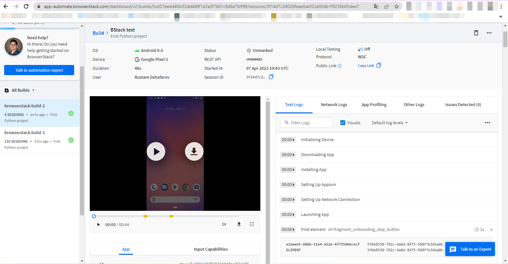

## The project of mobile autotests was implemented for the Wikipedia application
### Technologies used

<code></code>
<code></code>
<code></code>
<code></code>
<code></code>
<code></code>
<code></code>
<code></code>
<code></code>
<code></code>
<code></code>
<code></code>

  

### Что проверяют тесты
* Search
* Language changes
 

### Ability to run tests on different environments:
* remote test bench
* real devices
* emulators 

###  [Starting a project in Jenkins](https://jenkins.autotests.cloud/user/oksana/builds)
##### Clicking on "Build Now" will start building tests and running them on the server Jenkins.

###  Starting a project in Browserstack
##### After starting the build in Jenkins, the tests begin to pass remotely through the Browserstack. Where in real time you can monitor the passage of the test throughз логи.

#### Video of passing tests on

###  Allure report
##### Based on the results of passing the tests, an Allure report is generated.

##### The Behaviors tab contains collected test cases, which describe the steps. Attachments are implemented for api methods. For combined tests, at the end of the test, a screenshot is taken and a video recording of the test is saved.

##### Video passing the test.

#### You can view the test logs on browserstack.:

##### Implemented integration with Allure TestOps and Jira.

###  Integration with Telegram
##### At the end of the tests, send a mini report to telegram

